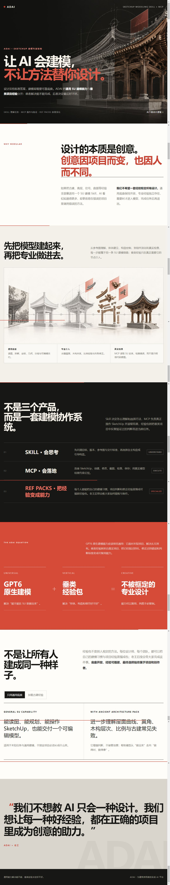

# ADAI SketchUp Skill + Managed MCP



这是 ADAI 的可分发 SketchUp 建模包：一个面向 **PipClaw 与 Codex** 的 `professional-sketchup-modeling` Skill，加上配套的 `sketchup-managed` MCP。它让 Agent 先理解建筑空间与来源，再通过共同建筑专业底座、guided/autonomous 双策略、受管 Ruby、真实读回和视图复核交付可编辑 SKP。autonomous 可按授权工作单元连续组合受管操作并合并审核，仍使用同一保护和质量门禁。

## 当前版本

- 版本：`0.5.31`
- 构建：`0.5.31-method-route-20260924`
- 许可：CPAL-1.0（见 `LICENSE`）
- 运行入口：MCP 的 `launch.cjs`
- 适配基线：Windows、Node.js 18+、Python 3.10+、SketchUp 2018/2019；更高版本需按宿主实际 Ruby/API 复核。

## 包内容

- `skill/professional-sketchup-modeling/`：可直接安装到 Codex 或 PipClaw 的 Skill。
- `mcp/sketchup-managed-mcp/`：MCP 运行包，包含桥接、受管项目、公开工具包和随附 REF。
- `dist/`：同一构建生成的两个 ZIP。
- `docs/EXPERIENCE-PACKS.md`：经验包格式、加载与验证方式。

源码中的 `engineering/` 保存开发测试与交接；两个运行 ZIP 不包含该目录、测试替身、临时日志、用户模型、私钥或本机配置。

## 内置经验包与 GPT6 触发词

当前发行包只内置一个经验包：`adai-ancient-architecture`（古建，随 MCP 提供）。其他 REF 包需要按 [`docs/EXPERIENCE-PACKS.md`](docs/EXPERIENCE-PACKS.md) 单独加载；用户自建包不会被覆盖。

使用 GPT6 建模时，建议把下面任一行放在任务第一条非空行，以选择 v2 专家工作单元策略：自主组合构造、按需取证和合并审核：

```text
ADAI老王，开启专家模式
开启ADAI老王专家模式
```

这两个触发词选择 `autonomous` 执行策略；不放宽权限、真实成果要求或未知写入恢复屏障。旧项目保留原策略，不静默升级。使用其他模型时不需要触发词，默认 `guided` 模式即可。

## 安装

把 `skill/professional-sketchup-modeling` 复制到当前宿主的 Skill 目录：Codex 使用 `$CODEX_HOME/skills/`；PipClaw 使用其 `codex-home/skills/`。把 MCP 目录复制到用户本机的 MCP 目录，并让 PipClaw/Codex 的 MCP 配置指向该目录中的 `launch.cjs`。安装器应在本机生成路径；发行包不写死用户目录、SketchUp 路径、PID 或会话令牌。

首次运行只绑定用户明确指定的 SketchUp.exe。启动后先读取短卡、状态、ping 和模型摘要；未保存文档与多实例保护仍由 MCP 负责。

## 经验包

经验包使用 `REF.md` 元数据和按阶段章节，按主题匹配后按需读取。请先看 [`docs/EXPERIENCE-PACKS.md`](docs/EXPERIENCE-PACKS.md)。经验包只提供方法和来源经验，不能替代实时几何读回、视觉审查或交付门禁。

## 后续版本更新

后续版本继续推送到本仓库：更新 Skill/MCP 源码和版本号，生成新的干净 ZIP，更新构建标识与 `SHA256SUMS.txt`，然后提交并推送到 `main`。每次发行使用新的构建标识和校验值；不覆盖用户自建 REF 包、旧 MCP 槽位或现有项目；发布前重新运行发布器自带的安装冒烟检查。

本构建为工程候选。测试命令和真实范围见 `engineering/README.md`；本构建的 Windows/SketchUp 建模、建筑来源对照、渲染、保存重开及第二台机器验收均为 `not_run`。

本仓库当前是可分发的工程回归候选；官方签名服务尚未配置，不能把“能安装”表述为官方签名。

## Attribution

建筑建模 Skill 由 ADAI 老王提供。ADAI 标识只用于许可要求的归属，不写入 SKP 几何或隐藏模型属性。


## 本轮直接修改

专家使用 `step(ruby_file=...)` 或 `step(operations=[...])`，相关多笔构造后按需 `retry_evidence(views=...)`，实际看图后用视觉简写 review，再 finish。工作单元、原操作、缺失机器附件和问题状态由程序维护。详见 Skill 的专家指引、受管操作、来源尺寸和图像对照文档。

显式尺寸核对目前覆盖唯一可定位构件的局部轴尺寸及世界缩放，不是 CAD 自动识图、面积语义或建筑规范验证。每次写入保守失效全项目视觉结论；对象授权以建筑系统单元为界，不承诺任意拓扑手术或跨单元共享定义自动修改。
